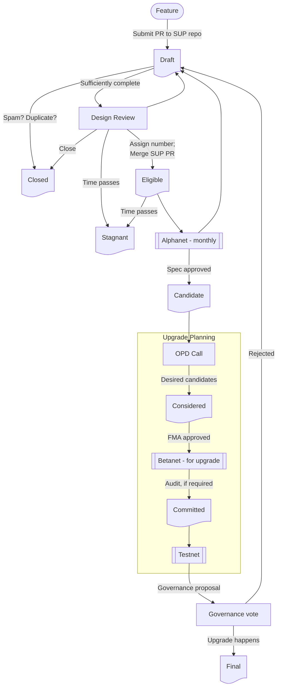

# Superchain Upgrade Proposals

&#x1F6A7; Please note that this is a beta-version of a Superchain upgrade
process that we will debug and evolve over time. We welcome teams to begin
contributing SUPs, and we expect that from Upgrade 15 (mid-2025) SUPs will be
the primary or only path to upstreaming features into the OP Stack. Meanwhile,
please be patient if SUP progress is a little slower while we continue to work
on Upgrades 12-14. &#x1F6A7;

---

<!-- START doctoc generated TOC please keep comment here to allow auto update -->
<!-- DON'T EDIT THIS SECTION, INSTEAD RE-RUN doctoc TO UPDATE -->

- [Introduction](#introduction)
- [Rationale](#rationale)
- [Scope](#scope)
- [SUP Contents](#sup-contents)
  - [SUP Header](#sup-header)
  - [SUP Sections](#sup-sections)
  - [Style Guide](#style-guide)
- [SUP Process](#sup-process)
  - [Roles](#roles)
  - [Key Forums](#key-forums)
    - [Design Review](#design-review)
    - [Optimism Protocol Devs](#optimism-protocol-devs)
  - [Status Labels](#status-labels)
  - [Process Flowchart](#process-flowchart)

<!-- END doctoc generated TOC please keep comment here to allow auto update -->

## Introduction

A SUP is a Superchain Upgrade Proposal, a document describing a change to
Optimism's core technical protocol, the "OP Stack".

The SUP process is not Optimism's governance process, although it is an input
into it. In that respect it differs from the EIP (Ethereum Improvement Proposal)
process, which _is_ Layer&nbsp;1's governance. Nevertheless, the SUP process is
informed by the EIP process and resembles it in some ways.

A consequence of this is that we do not need the SUP process to be perfect from
the outset, and it is intended to iterate and improve it over time.

## Rationale

SUPs, and the process around them, are designed to achieve three goals:

1. Increase the _inclusiveness_ of the OP Stack upgrade process.

    Any person or organisation involved in the Optimism protocol development is
    able to make SUPs and participate in the SUP decision-making workflow. SUPs
    provide an accessible "front-end" for OP Stack development.

1. Increase the _transparency_ of the OP Stack upgrade process.

    SUP documentation is public. The SUP decision-making process is open and
    transparent. Discussion happens publicly on GitHub and Discord, and decision
    making on calls that are open and recorded, with the recordings being shared
    publicly.

1. Improve _discipline_ around the OP Stack upgrade process.

    A single SUP document that tracks each feature from start to end makes for
    simpler project management. Quality criteria for SUPs ensure consistency. A
    defined process reduces confusion.

## Scope

Any OP Stack feature that requires an Optimism governance vote should go
through the SUP process (emergency upgrades are a possible exception to this
rule). OP Stack features that do not require a governance vote may choose to
use the SUP process.

Some guidelines as to when a governance vote is required are discussed under
heading 1 of [this
document](https://oplabs.notion.site/OP-Mainnet-release-flow-explained-high-level-overview-d578beb3f01344e9847cb7fc92a112b7#aace8e107bb1430888c7629de412ce76).

## SUP Contents

See the [SUP template](SUPs/_TEMPLATE.md) for the format. That file must be
copied to `SUP-NNNN.md` before being submitted as a PR to the SUPs
repository. At a later stage, before the SUP is merged, the `NNNN` will be
replaced with the assigned SUP number. Any assets referred to by the SUP
(images, data) must be placed in the directory `assets/SUP-NNNN/`. Again, this
will be renamed with the SUP number once assigned, before merging.

SUPs are written in [GitHub Flavored Markdown](https://github.github.com/gfm/),
with all prose in English. They should pass
[markdownlint](https://github.com/DavidAnson/markdownlint) cleanly with its
default ruleset.

### SUP Header

A SUP begins with metadata associated with the SUP in YAML format, sometimes
called frontmatter.

```yaml
sup: NNNN
title: 
champion:
author: 
created: YYYY-MM-DD
eligible: YYYY-MM-DD
requires: 
status: Draft
```

The following fields are required, even if empty.

- `sup`: The SUP number. SUP numbers have four decimal digits and will be
  assigned consecutively starting from `0001`. The number will be assigned once
  there is general agreement that the SUP is complete, of good quality, and
  there is a desire to proceed with it.
- `title`: A concise but descriptive title. We prefer referring to titles over
  referring to numbers, so make it easy for us.
- `champion`: The single, named individual who will be responsible for
  shepherding the SUP through the process from start to finish. The champion can
  change, but a SUP with no champion is unlikely to progress.
- `author`: The SUP author's name; can be multiple, comma separated. The
  champion does not need to be an author, but list them here as well if they
  are. See [EIP-1](https://eips.ethereum.org/EIPS/eip-1#author-header) for the
  format.
- `created`: The date the SUP was first submitted.
- `eligible`: The date the SUP was assigned a SUP number, that is, when it
  achieved `Eligible` status. It will be blank for `Draft` SUPs.
- `requires`: A comma-separated list of existing SUP numbers that this SUP
  depends on. SUPs that are `Final` can be omitted.
- `status`: This will start at `Draft` for all SUPs, and will be updated by the
  SUP editors as the SUP progresses through the stages. The full list of
  statuses can be found [below](#status-labels).

An optional field, `closed-reason` may be present for `Closed` SUPs. It is a
single sentence explaining why the SUP was closed or withdrawn.

### SUP Sections

A SUP is not expected to be complete and fully formed on first submission. The
design review stage is iterative, and SUPs will progress in completeness until
they acquire `Candidate` status.

A `Draft` SUP should contain at least the Description, the Motivation and
Impact, and the Design sections. Starting work on the FMA section as early as
possible is also recommended.

We recognise that the specification is often informed by working on an
implementation. Therefore, the Specification section does not need to be fully
signed-off until after the feature has run on an Alphanet, as per the
[flowchart](#process-flowchart).

- **Description**
  - A concise technical paragraph providing an overview of the SUP. Someone
    should be able to read only this description to get the gist of the SUP's
    purpose.
- **Motivation and Impact**
  - Provides the reason we should implement the SUP. Clearly explain why the
    existing protocol specification is inadequate to address the problem that
    the SUP solves. As for impact, this means describing the anticipated
    benefits of the SUP and who exactly will gain those benefits. SUPs with low
    or unclear benefits are unlikely to progress.
- **Design**
  - Describe the approach to solving the problem and why it is the best
    approach. Previous design documents can be found
    [here](https://github.com/ethereum-optimism/design-docs/tree/main/protocol),
    and this section should follow a similar format.
- **Specification**
  - Describe how the SUP should be implemented. The specification should be
    sufficiently detailed to allow an implementation to be written without
    relying on other resources. Previous specification documents can be found
    [here](https://github.com/ethereum-optimism/specs/tree/main/specs), and this
    section should follow a similar format.
  - It is permitted and encouraged for the specification here to be a link out
    to a Spec PR in that repo so that the OP Spec can be formatted as a [nice
    gitbook](https://specs.optimism.io/).
- **Backwards Compatibility**
  - Describe any incompatibilities and their consequences.
- **Failure Modes Analysis**
  - The FMA is a security-related document that analyses the risks associated
    with implementing the SUP, and presents mitigations for those
    risks. Previous FMAs can be found
    [here](https://github.com/ethereum-optimism/design-docs/tree/main/security)
    and should follow a similar format. [Some
    guidance](https://github.com/ethereum-optimism/design-docs/blob/main/security/failure-modes-analysis.md)
    is also available.
- **Progress Checklist**
  - This acts both as an outline of the SUP process and a measure of
    progress. It should be updated only by a SUP editor.

### Style Guide
<!-- markdownlint-disable no-emphasis-as-heading -->

**Titles**

The `title` field in the preamble:

- Should not include the word "standard" or any variation thereof; and
- Should not include the SUP's number.

**Descriptions**

The `description` field in the preamble:

- Should not include the word "standard" or any variation thereof; and
- Should not include the SUP's number.

**SUP numbers**

When referring to another SUP, it must be written in hyphenated form `SUP-XXXX`
where `XXXX` is that SUP's four digit assigned number. When referring to a SUP
by number, authors should also include the SUP's title. (`Draft` SUPs, without
assigned number, may be referred to by their title.)

**RFC 2119 and RFC 8174**

SUPs are encouraged to follow [RFC 2119](https://www.ietf.org/rfc/rfc2119.html)
and [RFC 8174](https://www.ietf.org/rfc/rfc8174.html) for terminology and to
insert the following at the beginning of the Specification section:

> The key words "MUST", "MUST NOT", "REQUIRED", "SHALL", "SHALL NOT", "SHOULD",
> "SHOULD NOT", "RECOMMENDED", "NOT RECOMMENDED", "MAY", and "OPTIONAL" in this
> document are to be interpreted as described in RFC 2119 and RFC 8174.

**External links**

In general, the use of links to external resources in SUPs is
discouraged. However, the guidelines in
[EIP-1](https://eips.ethereum.org/EIPS/eip-1#linking-to-external-resources)
should be applied, suitably reinterpreted for the OP Stack.

<!-- markdownlint-enable no-emphasis-as-heading -->
## SUP Process

The SUP process is guided by the IETF's tenet, "rough consensus and running
code".

Rough consensus is achieved through the Optimism Protocol Devs (OPD) call, see
[below](#optimism-protocol-devs).

The "running code" part is encouraged by the requirement for SUPs to run on a
set of Alphanets and Betanets according to the [OP Stack release
process](https://pm.optimism.io/release-process.html). For a SUP to be in scope
for the OPD call, an implementation must have achieved `Candidate` status (at a
minimum) by having run on an Alphanet.

### Roles

Certain roles are defined to support the SUP process.

- **OPD Chair**
  - The OPD Chair assembles the agenda for and coordinates the regular OPD
    calls. The chair is responsible for gauging rough consensus and confirming
    decisions made, and also for assembling and submitting the governance
    proposal for an upgrade.
- **SUP Editors**
  - The SUP Editors are a team having write/merge access to the SUPs GitHub
    repository. They are responsible for maintaining the repo and SUPs in good
    order, including assigning SUP numbers. All PRs must be approved by a SUP
    editor before merging.
- **SUP Champion**
  - Every SUP must have single, named individual who is responsible for
    shepherding that SUP through the process from start to finish. Part of the
    champion's role is to vet the idea before submission - that is, to gain some
    confidence that the feature is needed and is likely to be accepted by the
    broader OP Stack dev community. The champion should actively try to build
    community consensus around the SUP.

### Key Forums

Three key forums are shown on the flowchart in rectangles: Design Review,
Optimism Protocol Devs, and Governance. The first two form part of the SUPs
process, while Optimism Governance voting is an existing process that should be
considered external to the SUP process.

#### Design Review

The Design Review is a relatively unstructured process of quality-checking SUP
submissions and confirming their technical feasibility and desirability. It is
an iterative process with the goal of progressing SUPs to `Eligible` status. The
SUP's Champion is responsible for ensuring that progress is made. Note that this
part of the process is not yet tightly defined, and will be evolved to ensure
that it is effective.

Design Review discussion will take place in the open: in public GitHub comments
on the SUP, on the Optimism R&D Discord server, and in open calls that appear on
the [R&D Protocol
Calendar](https://calendar.google.com/calendar/u/0/embed?src=c_e7b35eadabec39777b28192d371c45b6ef4177e01740517a234e7c768881fbfe@group.calendar.google.com&ctz=Etc%2FUTC).

Anyone with a stake in the OP Stack protocol may participate in Design
Review. In addition to protocol developers, members of the [Developer Advisory
Board](https://gov.optimism.io/t/developer-advisory-board/6892) and members of
protocol product teams are particularly encouraged to participate.

It is the role of the SUP's champion to manage a SUP's progress through this
stage. The champion is responsible for ensuring that the SUP is maintained, that
design reviews take place, and that all feedback is addressed. SUP editors will
assist, but are ultimately not responsible for the SUP making progress.

The design review phase can be thought of as analogous to mempool
management. Each SUP is like a transaction that must be validity-checked before
being added to the pool of `Eligible` SUPs.

#### Optimism Protocol Devs

Optimism Protocol Devs (OPD) is a regular interactive call modelled on the
Ethereum All Core Devs (ACD) calls. The goals of this meeting are first to
progress `Candidate` SUPs towards being included in OP Stack upgrades, and
second to coordinate the delivery of those upgrades in accordance with the [OP
Stack release process](https://pm.optimism.io/release-process.html).

OPD calls are upgrade-centric. They deal primarily with SUPs that have made it
to `Candidate` status, and their task is to progress an optimal bundle of such
SUPs into a governance proposal, and thence into an OP Stack upgrade.

OPD calls take place in the open, with recordings and notes published. Anyone
with a stake in the OP Stack protocol is permitted to participate in OPD
calls. Attendance is likely to be similar to that of the Design Reviews, but
broader.

Calls are managed by the Chair, and decisions are reached by [rough
consensus](https://datatracker.ietf.org/doc/html/rfc7282), guided by the Chair.

The OPD process can be thought of as analogous to a block building process. SUPs
are extracted from the pool of `Eligible` candidates and bundled into blocks
that are submitted as a unit to governance before being appended to the chain of
protocol upgrades.

### Status Labels

A SUP's status is tracked by the `status` field in the SUP's metadata. For
project management purposes, a GitHub Status label might also be assigned, but
the SUP's metadata is the source of truth.

The `status` must be one of the following.

- `Draft`: A SUP that has not yet been merged or assigned a number. It may be
  incomplete or awaiting review against the quality criteria. All SUPs start
  with `Draft` status.
- `Closed`: Cannot be resurrected under the same number (if it got as far as one
  being assigned). This category includes SUPs withdrawn by their authors.
- `Stagnant`: Any SUP that is not closed and has not had an edit or status
  change for six months is moved to `Stagnant`. It can be resurrected by
  consensus.
- `Eligible`: Has passed design review and other quality criteria and been
  assigned a SUP number. At this point the original PR is merged into the SUPs
  repo. All further updates will be made via fresh PRs to the SUP.
- `Candidate`: An `Eligible` SUP that has run on an Alphanet and its
  specification has been approved.
- `Considered`: A `Candidate` SUP that is being actively targeted for the next
  upgrade. It will be run on the upgrade's Betanet and its FMA is complete.
- `Committed`: A `Considered` SUP that has run on the upgrade's Betanet. It will
  progress to the Testnet and included in the governance proposal if all is
  well.
- `Final`: Has been deployed.

### Process Flowchart


